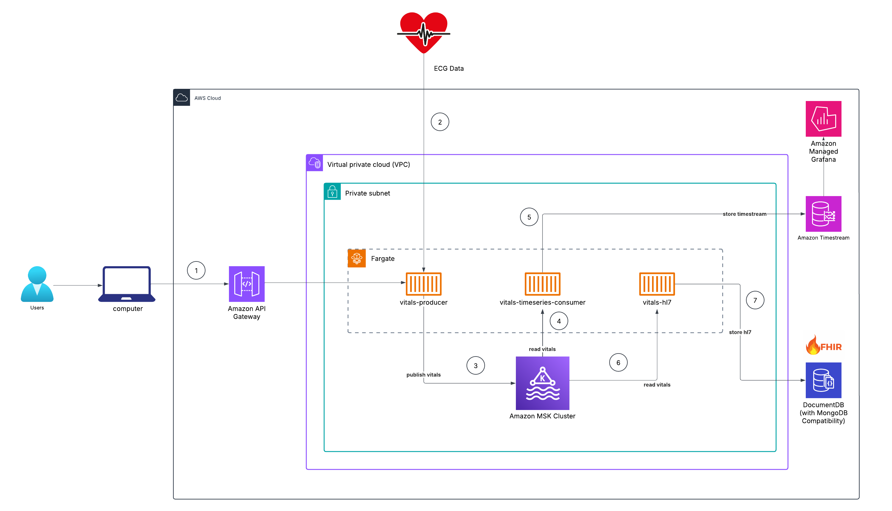

# Heart Rate Anomaly Detection

This project is a scalable pipeline that processes patient time-series data from the MIMIC-III Waveform Database.  This databse contains thousands of recordings of multiple physiologic signals (“waveforms”) and time series of vital signs (“numerics”) collected from bedside patient monitors in adult and neonatal intensive care units (ICUs).  The producer reads .dat files, processes them, and sends the data to a Kafka topic to be inserted into a time-series database and converted into HL7 FHIR records and stored in a NoSQL database.  Vitals like heart rate, blood pressure, respiration rate and oxygen saturation can be visualized with a custom dashboard in Grafana. 

## Architecture



1. User sends a POST request to the `/fetchPatientData` resource on the API gateway with the following:

``` json
{
    "fetchPatientId": "p010124"
}
```

2. The `vitals-producer` application running in Fargate retrieves the raw EGC data for the requested patient id in a `dat` file containg.  

3. There are multiple samples per second (e.g. 250 per second of ECG data)  and each sample is batched, compressed and sent to a kafka topic.  

A sample kafka message looks like this:

``` json
{
  "time": "2025-05-09T23:15:00Z",
  "patient_id": "p000020",
  "ECG_I": 0.12,
  "ECG_II": 0.15,
  "ECG_III": -0.10,
  "ABP": 120.0,
  "RESP": 16.5,
  "SpO2": 98.0,
  "heart_rate": 75,
  "systolic_bp": 120.0,
  "diastolic_bp": 80.0,
  "respiratory_rate": 16,
  "mean_arterial_pressure": 93.0
}
```

4. The `vitals-timeseries-consumer` application reads from the kafka topic 

5. and stores the data in a timeseries database, to be viewed on Grafana.

6. The `vitals-hl7` application reads the vitals from the kafka topic, creates a FHIR (Fast Healthcare Interoperability Resources) record  

7. and stores it in MongoDB for interoperability purposes.  Here's what the corresponding FHIR record looks like for the Kafka payload above:


``` json
{
  "resourceType": "Observation",
  "id": "example-observation-id",
  "status": "final",
  "category": [
    {
      "coding": [
        {
          "system": "http://terminology.hl7.org/CodeSystem/observation-category",
          "code": "vital-signs",
          "display": "Vital Signs"
        }
      ],
      "text": "Vital Signs"
    }
  ],
  "code": {
    "coding": [
      {
        "system": "http://loinc.org",
        "code": "8462-4",
        "display": "Heart rate"
      },
      {
        "system": "http://loinc.org",
        "code": "85354-9",
        "display": "Systolic blood pressure"
      },
      {
        "system": "http://loinc.org",
        "code": "8460-7",
        "display": "Diastolic blood pressure"
      },
      {
        "system": "http://loinc.org",
        "code": "2710-2",
        "display": "Respiratory rate"
      },
      {
        "system": "http://loinc.org",
        "code": "59408-5",
        "display": "Oxygen saturation"
      }
    ],
    "text": "Heart rate, Blood pressure, Respiratory rate, Oxygen saturation"
  },
  "subject": {
    "reference": "Patient/p000020",
    "display": "Patient p000020"
  },
  "effectiveDateTime": "2025-05-09T23:15:00Z",
  "valueQuantity": [
    {
      "value": 75,
      "unit": "beats/minute",
      "system": "http://unitsofmeasure.org",
      "code": "/min"
    },
    {
      "value": 120,
      "unit": "mmHg",
      "system": "http://unitsofmeasure.org",
      "code": "mm[Hg]"
    },
    {
      "value": 80,
      "unit": "mmHg",
      "system": "http://unitsofmeasure.org",
      "code": "mm[Hg]"
    },
    {
      "value": 16,
      "unit": "breaths/minute",
      "system": "http://unitsofmeasure.org",
      "code": "/min"
    },
    {
      "value": 98,
      "unit": "%",
      "system": "http://unitsofmeasure.org",
      "code": "%"
    }
  ],
  "interpretation": {
    "coding": [
      {
        "system": "http://terminology.hl7.org/CodeSystem/v3-ObservationInterpretation",
        "code": "N",
        "display": "Normal"
      }
    ]
  }
}
```


## Local Setup

This project uses Docker Compose to set up and run a complete local environment for simulating heart rate anomaly detection. The services are orchestrated using Docker Compose and can be easily transitioned to cloud environments like AWS using Kubernetes later.

### **Services Overview**

- **Zookeeper**  
  - Acts as the centralized service for managing Kafka brokers.  
  - Exposes port `2181` for Kafka to connect and synchronize.

- **Kafka**  
  - A distributed messaging system used for event-driven architectures.  
  - Exposes ports `9093` (internal) and `9094` (external).  
  - Configured to not auto-create topics, which ensures that only explicitly defined topics are available.  
  - Connects to Zookeeper for cluster management and coordination.

- **Kafka Manager**  
  - A web-based UI for managing Kafka clusters.  
  - Exposes port `9000` for access.  
  - Enables the monitoring and management of Kafka topics, brokers, and more.

- **Vitals Producer**  
  - Simulates sending health data (e.g., heart rate, respiratory rate) to Kafka.  
  - Built from the `./apps/producers/retrieve-vitals` directory.  
  - Configured to push messages to the Kafka topic `vitals`.

- **Vital Timeseries Consumer**  
  - Consumes data from Kafka and writes it into InfluxDB for time-series storage and analysis.  
  - Built from the `./apps/consumers/vital-timeseries` directory.  
  - Reads Kafka data and uses InfluxDB for storing health data, including heart rate and respiratory rate.

- **InfluxDB**  
  - A time-series database used to store and analyze health-related data.  
  - Exposes port `8086` for data storage and retrieval via HTTP API.  
  - Configured to interact with Kafka and store data in a bucket named `vitals`.

## **Services Breakdown**

### **Zookeeper**
- **Purpose**: Kafka requires Zookeeper for managing brokers and maintaining the Kafka cluster.
- **Ports Exposed**: 2181 (Zookeeper client port)
- **Healthcheck**: Ensures Zookeeper is ready before Kafka attempts to connect.

### **Kafka**
- **Purpose**: The message broker in the system, used to store and transmit health data.
- **Ports Exposed**: 9093 (internal communication) and 9094 (external access).
- **Configuration**: Configured to communicate with Zookeeper and manually manage topics.

### **Kafka Manager**
- **Purpose**: A user-friendly web interface to manage Kafka clusters and topics.
- **Ports Exposed**: 9000 for accessing the Kafka Manager UI.
- **Functionality**: Used to monitor Kafka topics and manage Kafka cluster configuration.

### **Vitals Producer**
- **Purpose**: Simulates a producer of health data, pushing it to Kafka for processing.
- **Ports Exposed**: 8081 (local endpoint to interact with the producer service).
- **Environment Variables**: Configured with Kafka broker details and the `vitals` topic.
- **Functionality**: Sends simulated health data (e.g., heart rate, respiratory rate) to Kafka.

### **Vital Timeseries Consumer**
- **Purpose**: Consumes health data from Kafka and writes it into InfluxDB.
- **Ports Exposed**: N/A (does not expose ports, runs in the background).
- **Environment Variables**: Configured to connect to both Kafka and InfluxDB with the appropriate credentials and endpoints.
- **Functionality**: Consumes messages from Kafka and stores the processed health data (heart rate, respiratory rate) in InfluxDB.

### **InfluxDB**
- **Purpose**: A time-series database for storing and analyzing heart rate and other health data.
- **Ports Exposed**: 8086 for accessing the InfluxDB HTTP API.
- **Environment Variables**: Configured to store health data in a bucket named `vitals`.
- **Healthcheck**: Ensures that InfluxDB is ready to accept data before other services interact with it.

## **How It Works Locally**

1. **Zookeeper** initializes first and waits for Kafka to connect to it.
2. **Kafka** starts and waits for Zookeeper to become available, then listens for incoming messages.
3. **Kafka Manager** is accessible via `localhost:9000` for monitoring and managing Kafka.
4. **Vitals Producer** sends health data to Kafka at regular intervals.
5. **Vital Timeseries Consumer** reads health data from Kafka and writes it to InfluxDB.
6. **InfluxDB** stores the incoming health data (heart rate, respiratory rate, etc.) in the `vitals` bucket for analysis.

## **Running the Services**

To start the services locally with Docker Compose:

1. Clone the repository:
    ```bash
    git clone <repository-url>
    cd <project-directory>
    ```

2. Build and start the containers:
    ```bash
    docker-compose up --build
    ```

3. Access the services:
    - Kafka Manager: `http://localhost:9000`
    - InfluxDB: `http://localhost:8086`
    - Producer: `http://localhost:8081`
    
4. Verify that Kafka topics and data are correctly configured.

### **Future Migration to AWS (Kubernetes)**

- The services are configured to run locally using Docker Compose. When transitioning to AWS, you will need to:
  - Migrate the setup to **Kubernetes** using Kubernetes manifests or Helm charts.
  - Replace Docker Compose's `depends_on` and health checks with Kubernetes' native mechanisms (e.g., **readiness probes**).
  - Use **AWS Secrets Manager** or **Kubernetes Secrets** to securely handle tokens and other sensitive data.

---
